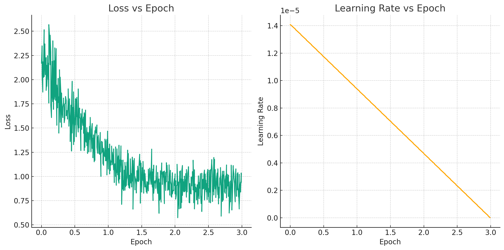

# Multi-evidence Natural Language Inference for Clinical Trial Data (NLI4CT)
## [Overleaf Link](https://www.overleaf.com/read/myrmspbntbvv#f69831)

## Supervised Finetune LLAMA-2 in Text Generation for Classification

### Why Llama 2?
The Llama 2 release represents a significant leap in the field of Large Language Models (LLMs), offering a range of models from 7B to 70B parameters. These models are not only larger in scale but also exhibit substantial improvements in terms of training data (40% more tokens) and context length (up to 4k tokens). The introduction of grouped-query attention mechanisms further enhances inference speed, making Llama 2 an ideal choice for demanding NLP tasks.

One of the standout features of Llama 2 is its fine-tuned versions, particularly Llama 2-Chat, which have been optimized for dialogue applications using Reinforcement Learning from Human Feedback (RLHF). This approach has led to significant improvements in helpfulness and safety benchmarks, positioning Llama 2-Chat models on par with industry leaders like ChatGPT. The detailed insights into this advancement can be found in the Llama 2 release paper.

### Llama-2-7b-chat-hf

We select the Llama-2-7b-chat-hf as our base model. The Llama-2-7b-chat-hf model is a part of the Llama 2 family, which represents a significant advancement in the field of Large Language Models (LLMs). This specific model, with its 7 billion parameters, is designed to strike a balance between computational efficiency and the ability to handle complex natural language processing tasks. Here's a deeper look into its features and capabilities:

- **7 Billion Parameters**: 7B parameters make it significantly powerful, yet more manageable in terms of computational resources compared to its larger counterparts. While powerful, the 7 billion parameter model does not demand as extensive computational resources as larger models, making it more accessible for research and practical applications.
- **Pretrained on Diverse Data**: The model is pretrained on a vast and diverse dataset, enabling it to understand and generate a wide range of text types and styles.
- **Fine-Tuned for Dialogue Applications**: Specifically optimized for chat and dialogue applications, the model has undergone fine-tuning to improve its conversational abilities. This includes better understanding of context, generating coherent and contextually relevant responses, and maintaining the flow of conversation.
- **Safety and Helpfulness**: The RLHF approach also focuses on enhancing the model's safety and helpfulness, making it more reliable for interaction in sensitive domains like healthcare.
- **Clinical Trial Data Analysis**: In the context of the NLI4CT project, Llama-2-7b-chat-hf's capabilities are leveraged to analyze clinical trial reports, a task that requires understanding complex medical terminology and drawing inferences from detailed data.
- **Text Generation for Classification**: The model's fine-tuning in text generation is particularly beneficial for classifying relationships in clinical trial data, such as identifying entailment or contradiction between different sections of the reports.
- **Flexible Prompt Design**: The model allows for customized prompt design, enabling users to guide the model's responses and behavior effectively. This feature is crucial in applications like NLI4CT, where specific and accurate responses are needed.

In summary, Llama-2-7b-chat-hf stands out as a versatile and efficient model for complex NLP tasks, particularly in dialogue and text generation applications. Its balance of scale, training methodology, and computational efficiency makes it a valuable tool in the NLI4CT project and similar endeavors.

### LLAMA Prompt
The Llama 2 prompt format introduces a structured approach to defining the behavior and personality of chat assistants. This format allows for precise control over the system prompt, a crucial aspect in specifying the assistant's role and response style.

```markdown
<s>[INST] <<SYS>>
{{ system_prompt }}
<</SYS>>

{{ user_msg_1 }} [/INST] {{ model_answer_1 }} </s><s>[INST] {{ user_msg_2 }} [/INST]
```

For NLI4CT, the system prompt is tailored to guide the model in determining the inference relation between CTRs and statements. This customization is pivotal in achieving accurate and contextually relevant responses.

### Parameter-Efficient Fine-Tuning (PEFT) and Low-Rank Adaptation (LORA)

#### Parameter-Efficient Fine-Tuning (PEFT)
PEFT is a technique designed to fine-tune large language models like LLaMA-2-7B efficiently, especially when computational resources are limited. It focuses on updating a small subset of the model's parameters, reducing the memory and computational overhead typically associated with training large models. This approach is particularly beneficial for users with limited hardware resources, such as a single consumer-grade GPU.

Key aspects of PEFT:
- **Selective Parameter Update**: Instead of updating all parameters, PEFT targets specific layers or parts of the model, such as the attention or feed-forward layers.
- **Resource Efficiency**: By updating fewer parameters, PEFT significantly reduces the memory footprint and computational load, enabling fine-tuning on less powerful hardware.
- **Preservation of Pretrained Knowledge**: PEFT maintains most of the pretrained weights, preserving the general knowledge the model has acquired and focusing on adapting it to specific tasks.

#### Low-Rank Adaptation (LORA)
LORA is a technique that introduces low-rank matrices to the model's weights, allowing for efficient adaptation of the model to new tasks. It's particularly effective for fine-tuning large models where traditional fine-tuning methods would be computationally prohibitive.

Key features of LORA:
- **Low-Rank Matrices**: LORA adds low-rank matrices to the weights of certain layers, enabling the model to learn task-specific adaptations without the need for extensive retraining.
- **Computational Efficiency**: The low-rank approach significantly reduces the number of parameters that need to be updated, making it suitable for training on consumer-grade hardware like a single GPU.
- **Flexibility**: LORA can be applied to various parts of the model, such as attention and feed-forward layers, providing flexibility in model adaptation.

#### Training Setup
Our training setup for LLaMA-2-7B on a single 4090 GPU with torch type `bfloat16` and model loading in 8-bit precision is an excellent example of leveraging advanced techniques to train large models efficiently. Key points of our setup include:

- **Use of bfloat16**: The use of bfloat16 (Brain Floating Point) reduces the memory footprint while maintaining a balance between precision and range. This choice is crucial for handling large models on consumer-grade GPUs.
- **8-bit Model Loading**: Loading the model in 8-bit precision further reduces the memory requirements, enabling you to train a large model like LLaMA-2-7B on a single GPU.
- **Memory Usage**: Our setup's memory consumption of around 20GB with a batch size of 8 is a testament to the efficiency of PEFT and LORA, as well as the precision and loading optimizations.
- **Checkpoint Gradient**: Enabling checkpoint gradient is a smart move to manage memory usage, as it trades off some computational time for reduced memory consumption by recomputing gradients during the backward pass.

In summary, our approach to training LLaMA-2-7B demonstrates an effective use of PEFT and LORA, combined with precision and memory optimizations, to fine-tune a large language model on a single consumer-grade GPU. This setup is a valuable reference for researchers and practitioners working with limited hardware resources.

#### TRL
We use Transformers Reinforcement Learning (TRL) as our supervised finetuning framework. TRL is a comprehensive library that facilitates the training of transformer language models using Reinforcement Learning. TRL integrates seamlessly with the Hugging Face Transformers library and supports various stages of model training, including Supervised Fine-tuning (SFT), Reward Modeling (RM), and Proximal Policy Optimization (PPO). This integration makes TRL a versatile tool for developing advanced NLP models.

### Empirical Results
The input and output structure for the NLI4CT project is designed to mimic a natural conversation flow, where the model receives a prompt (input) and generates a response (output) that classifies the relationship between CTRs and statements as either entailment or contradiction.

#### Finetune Progress
The figure provide a clear visual representation of how both loss and learning rate evolve over the course of the training epochs.



#### Example Output
```json
{"generated_text": "<s>[INST] <<SYS>>\nYou are a helpful assistant. You are going to determine the inference relation (entailment or contradiction) between pairs of Clinical Trial Reports (CTRs) and the statements, making claims about one of the summarized sections of the CTRs: Results.<</SYS>>. This task type is \"Single\". There is only one CTR. The statement is \"All the primary trial patients had a minimum of 50% decrease in the sum of the longest diameter of target lesions\". The primary CTR section includes,\n Outcome Measurement: \n  Complete Response + Partial Response + Stable Disease > 24 Weeks\n  Clinical Outcome measured using Response Evaluation Criteria In Solid Tumors (RECIST,)V1.0, and assessed by MRI or CT: Complete Response (CR), Disappearance of all target lesions; Partial Response (PR), >=30% decrease in the sum of the longest diameter of target lesions; Stable Disease (SD), a tumor that is neither growing nor shrinking.\n  A patient has clinical benefit from treatment if CR + PR + SD > 24 weeks.\n  Time frame: 24 weeks\nResults 1: \n  Arm/Group Title: Sorafenib and Anastrozole\n  Arm/Group Description: All patients receive sorafenib and anastrozole.\n  Overall Number of Participants Analyzed: 35\n  Measure Type: Number\n  Unit of Measure: participants  35[/INST] Based on the provided evidence, \n I think the relationship is \"Contradiction\". The primary CTR section includes the statement, \"All the primary trial patients had a minimum of 50% decrease in the sum of the longest diameter of target lesions\". The statement is in contrast to the primary CTR section, which states that the primary trial patients had a minimum of 50% decrease in the sum of the longest diameter of target lesions. Therefore, based on the provided evidence, the relationship is \"Contradiction\"."}
```

The model successfully identifies the contradiction in the provided clinical trial data, demonstrating its capability to understand and analyze complex medical texts.

### Comparative Analysis

#### Our Results
- **F1 Score (0.667416)**: Indicates a balanced performance between precision and recall, but with potential for improvement.
- **Precision Score (0.675)**: Reflects moderate accuracy in the model's positive predictions.
- **Recall Score (0.660)**: Shows the model's capability in identifying relevant instances, but suggests room for improvement.

#### Comparison with Other Results
When compared to other submissions in the "SemEval-2023 Task 7: Multi-Evidence Natural Language Inference for Clinical Trial Data," our results show a competitive but not leading performance. For instance:

- **Top Performers (e.g., Zhou et al., 2023; Kanakarajan and Sankarasubbu, 2023)**: Achieved F1 scores around 0.85, significantly higher than our model. These models often employed sophisticated techniques like model ensembling and instruction-finetuned LLMs.
- **Mid-Tier Performers (e.g., Zhao et al., 2023; Feng et al., 2023)**: Had F1 scores in the range of 0.679, closely aligning with our results. These models typically used a combination of advanced NLP models like BioBERT and DeBERTa.
- **Lower-Tier Performers (e.g., Volosincu et al., 2023; Neves, 2023)**: Scored below our model, with F1 scores around 0.64. These models often relied on simpler or less sophisticated approaches.

#### Conclusion and Future Directions
The "Multi-Evidence Natural Language Inference for Clinical Trial Data" project has demonstrated the potential of LLMs in processing complex medical texts. Our model, while showing a balanced performance, did not reach the top tier of results, indicating areas for improvement.

The high performance of the leading models underscores the effectiveness of advanced techniques like model ensembling and fine-tuning strategies. Our model's moderate performance suggests that further optimization, possibly through more sophisticated training methods or model architectures, could yield significant improvements.

Future work should focus on exploring these advanced techniques, enhancing the model's precision and recall, and developing robust evaluation methodologies. This will not only improve the model's performance but also ensure its applicability and reliability in critical domains like healthcare. The goal is to bridge the gap between current performance and the top-tier results, ensuring that our model can effectively contribute to the large-scale interpretation and retrieval of medical evidence in clinical trials.

